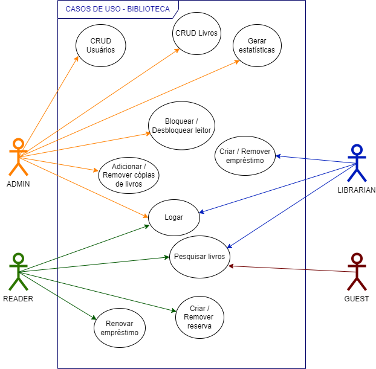
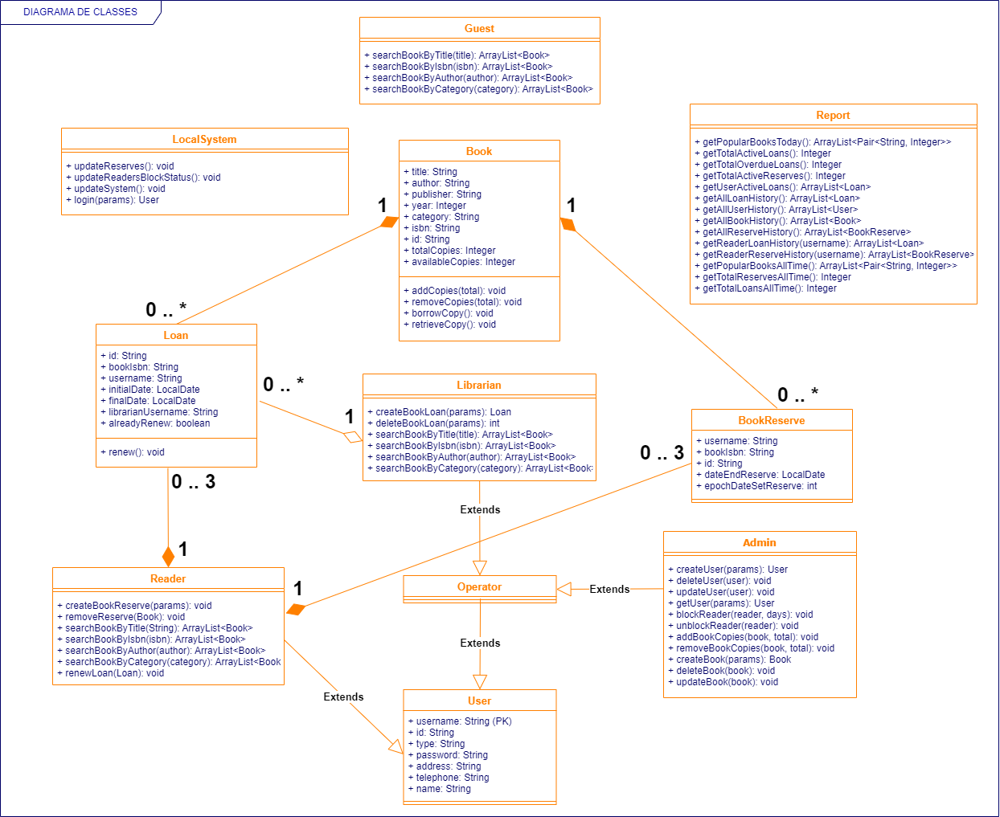

# Sistema Para Gerenciamento de Biblioteca
Sistema feito em Java, com a arquitetura MVC e o padrão de projeto DAO, com o objetivo de simular todas as funções necessárias para o funcionamento de uma biblioteca física.

## Features

### Fase 1 - Diagramas, implementação e testes (Release 1)
:white_check_mark: <b>Hierarquia</b>: Administrador, Bibliotecário e Leitor 

:white_check_mark: <b>Empréstimos e Devoluções</b>

:white_check_mark: <b>Reservas</b>

:white_check_mark: <b>Multas por atrasos</b>

:white_check_mark: <b>Bloqueio de leitores</b>

:white_check_mark: <b>Geração de relatórios e estatísticas gerais</b>

:white_check_mark: <b>Gerenciameto do acervo</b>

:white_check_mark: <b>Pesquisa de livros</b>

:white_check_mark: <b>Renovação de empréstimos</b>

:white_check_mark: <b>Sistema de login por tipo de usuário</b>

:white_check_mark: <b>Testes unitários e de integração</b>

### Fase 2 - Persistência de dados (Release 2)

:white_check_mark: <b>Armazenamento em arquivos ".ser"</b>

## Useful Info
### Release 1
Na primeira release, a implementação do armazenamento em arquivos já está no código, porém não está ativada. 

Existe uma constante na classe DAO chamada "TYPE_OF_STORAGE", que 
coordena onde serão armazenados os objetos, caso seja setada em "1", são salvos na memória, e "2", são salvos em arquivos do tipo ".ser".

Para realizar todos os testes de uma vez, é possível rodar o arquivo "mainTestSuite" no pacote de testes.

### Release 2
A única diferença da segunda release para a primeira, é a mudança no valor da constante "TYPE_OF_STORAGE".

Os testes dos dois tipos de armazenamento são idênticos, basta escolher o tipo na variável citada acima e eles rodam de acordo com ela.

### Release 3
Interface em JavaFX concluída. 

Existem três usuários criados inicialmente:

Tipo: Leitor, Username: leitor, Senha: leitor

Tipo: Administrador, Username: admin, Senha: admin

Tipo: Bibliotecário, Username: biblio, Senha: biblio

Para iniciar o programa, execute o arquivo "View" na camada view do MVC

## Diagrams
### Use Cases

### Classes

## Project Structure

### Versions
#### SDK OpenJDK 17.0.8
#### Intellij IDE
#### Junit 5.9.2

